# API Sequence Diagrams

This file has one sequence diagram for every controller endpoint (17 in total), one for the service use case that has no endpoint, and the Alert workflows. Service-level flowcharts for the same use cases are in [service-flows.md](service-flows.md).

> **Error-path convention.** Where a diagram shows an exception being thrown, the exception propagates out of the controller and is translated to an HTTP response by `GlobalExceptionHandler` (`@RestControllerAdvice`): not-found exceptions → 404, duplicate/conflicting-state exceptions → 409, invalid-input exceptions (including `IllegalArgumentException`/`IllegalStateException`) → 400, and failed `@Valid` (`MethodArgumentNotValidException`) → 400 with a `fieldErrors` list. Every response body follows the same `ErrorResponse` shape (`timestamp`, `status`, `error`, `message`, `path`, `fieldErrors`). Anything not explicitly mapped falls to a 500 catch-all.

## 0. Endpoint map

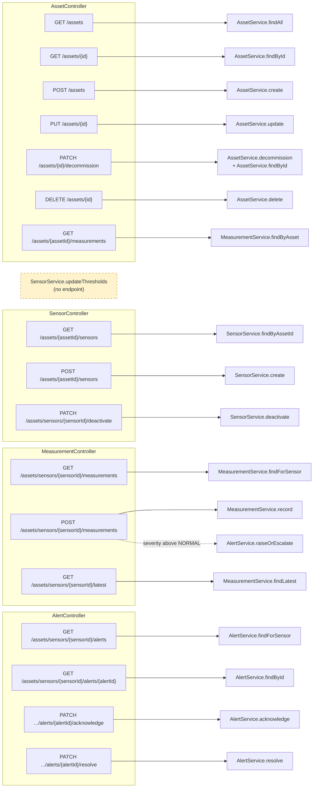
```mermaid
flowchart LR
    subgraph AssetController
        A1["GET /assets"]
        A2["GET /assets/{id}"]
        A3["POST /assets"]
        A4["PUT /assets/{id}"]
        A5["PATCH /assets/{id}/decommission"]
        A6["DELETE /assets/{id}"]
        A7["GET /assets/{assetId}/measurements"]
    end
    subgraph SensorController
        S1["GET /assets/{assetId}/sensors"]
        S2["POST /assets/{assetId}/sensors"]
        S3["PATCH /assets/sensors/{sensorId}/deactivate"]
    end
    subgraph MeasurementController
        M1["GET /assets/sensors/{sensorId}/measurements"]
        M2["POST /assets/sensors/{sensorId}/measurements"]
        M3["GET /assets/sensors/{sensorId}/latest"]
    end
    subgraph AlertController
        AL1["GET /assets/sensors/{sensorId}/alerts"]
        AL2["GET /assets/sensors/{sensorId}/alerts/{alertId}"]
        AL3["PATCH .../alerts/{alertId}/acknowledge"]
        AL4["PATCH .../alerts/{alertId}/resolve"]
    end

    A1 --> AS_findAll["AssetService.findAll"]
    A2 --> AS_findById["AssetService.findById"]
    A3 --> AS_create["AssetService.create"]
    A4 --> AS_update["AssetService.update"]
    A5 --> AS_decom["AssetService.decommission<br/>+ AssetService.findById"]
    A6 --> AS_delete["AssetService.delete"]
    A7 --> MS_byAsset["MeasurementService.findByAsset"]
    S1 --> SS_byAsset["SensorService.findByAssetId"]
    S2 --> SS_create["SensorService.create"]
    S3 --> SS_deact["SensorService.deactivate"]
    M1 --> MS_forSensor["MeasurementService.findForSensor"]
    M2 --> MS_record["MeasurementService.record"]
    M3 --> MS_latest["MeasurementService.findLatest"]
    M2 -.->|"severity above NORMAL"| ALS_raise["AlertService.raiseOrEscalate"]
    AL1 --> ALS_forSensor["AlertService.findForSensor"]
    AL2 --> ALS_findById["AlertService.findById"]
    AL3 --> ALS_ack["AlertService.acknowledge"]
    AL4 --> ALS_resolve["AlertService.resolve"]

    SS_thr["SensorService.updateThresholds<br/>(no endpoint)"]:::orphan

    classDef orphan stroke-dasharray: 5 5,fill:#fff3cd,stroke:#b8860b
```

## 1. AssetController

### E1 — `GET /api/v1/assets?status=` (list assets)

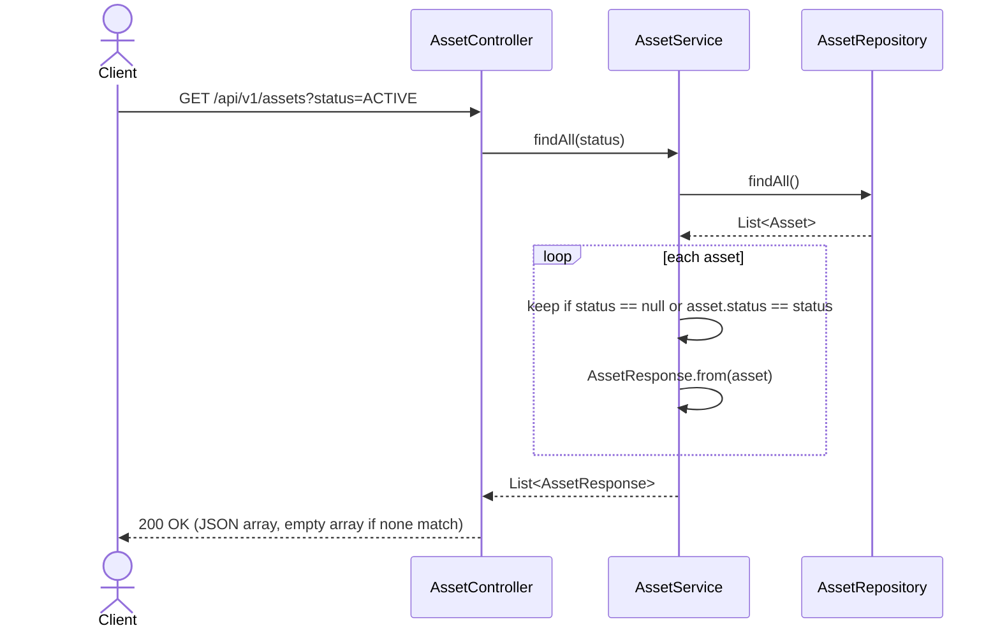
```mermaid
sequenceDiagram
    actor Client
    participant AC as AssetController
    participant AS as AssetService
    participant AR as AssetRepository

    Client->>AC: GET /api/v1/assets?status=ACTIVE
    AC->>AS: findAll(status)
    AS->>AR: findAll()
    AR-->>AS: List<Asset>
    loop each asset
        AS->>AS: keep if status == null or asset.status == status
        AS->>AS: AssetResponse.from(asset)
    end
    AS-->>AC: List<AssetResponse>
    AC-->>Client: 200 OK (JSON array, empty array if none match)
```

### E2 — `GET /api/v1/assets/{id}` (get one asset)

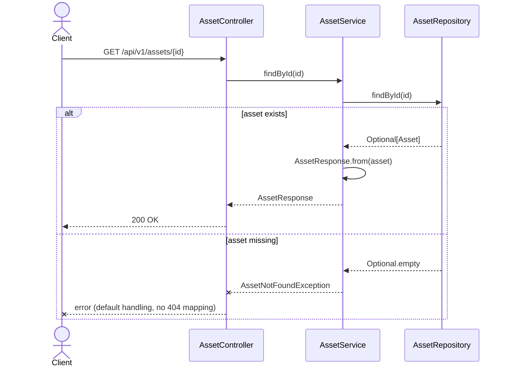
```mermaid
sequenceDiagram
    actor Client
    participant AC as AssetController
    participant AS as AssetService
    participant AR as AssetRepository

    Client->>AC: GET /api/v1/assets/{id}
    AC->>AS: findById(id)
    AS->>AR: findById(id)
    alt asset exists
        AR-->>AS: Optional[Asset]
        AS->>AS: AssetResponse.from(asset)
        AS-->>AC: AssetResponse
        AC-->>Client: 200 OK
    else asset missing
        AR-->>AS: Optional.empty
        AS--xAC: AssetNotFoundException
        AC--xClient: error (default handling, no 404 mapping)
    end
```

### E3 — `POST /api/v1/assets` (create asset)

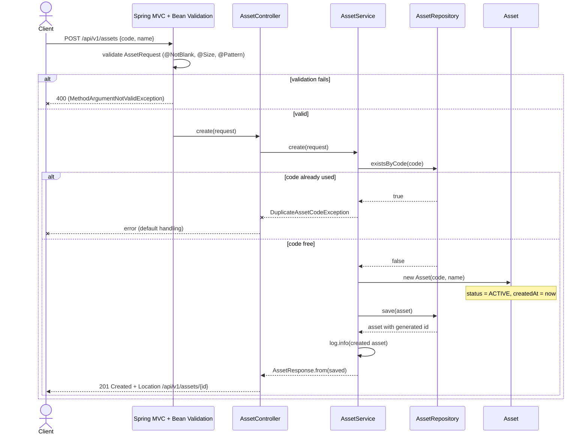
```mermaid
sequenceDiagram
    actor Client
    participant MVC as Spring MVC + Bean Validation
    participant AC as AssetController
    participant AS as AssetService
    participant AR as AssetRepository
    participant A as Asset

    Client->>MVC: POST /api/v1/assets {code, name}
    MVC->>MVC: validate AssetRequest (@NotBlank, @Size, @Pattern)
    alt validation fails
        MVC--xClient: 400 (MethodArgumentNotValidException)
    else valid
        MVC->>AC: create(request)
        AC->>AS: create(request)
        AS->>AR: existsByCode(code)
        alt code already used
            AR-->>AS: true
            AS--xAC: DuplicateAssetCodeException
            AC--xClient: error (default handling)
        else code free
            AR-->>AS: false
            AS->>A: new Asset(code, name)
            Note over A: status = ACTIVE, createdAt = now
            AS->>AR: save(asset)
            AR-->>AS: asset with generated id
            AS->>AS: log.info(created asset)
            AS-->>AC: AssetResponse.from(saved)
            AC-->>Client: 201 Created + Location /api/v1/assets/{id}
        end
    end
```

### E4 — `PUT /api/v1/assets/{id}` (update / rename asset)

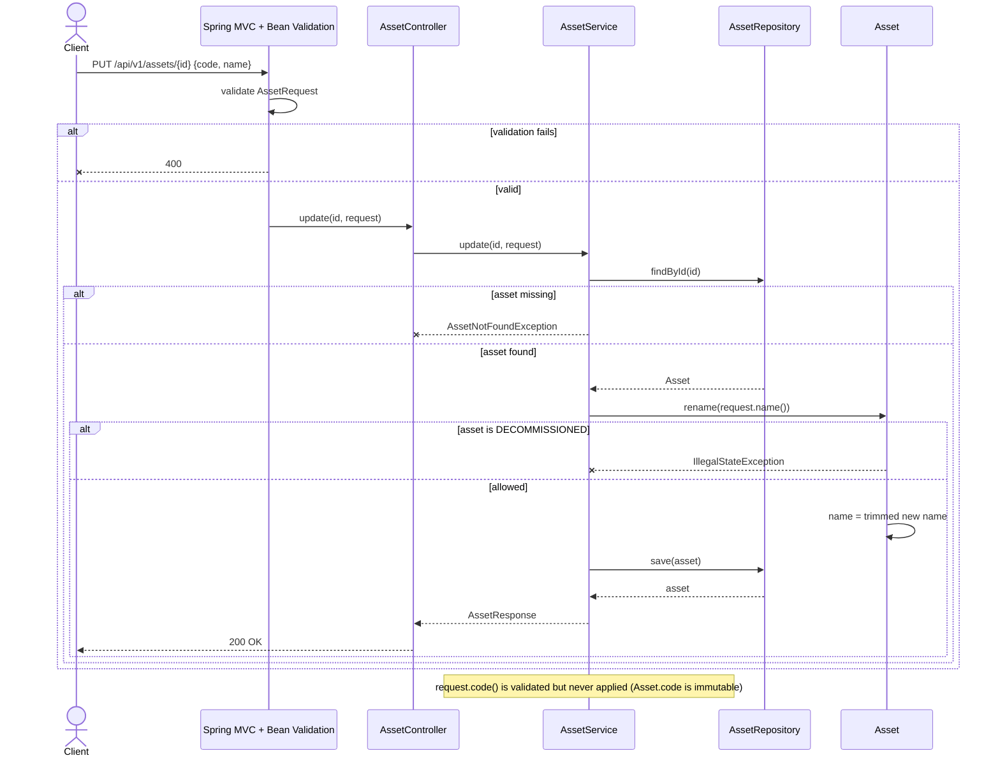
```mermaid
sequenceDiagram
    actor Client
    participant MVC as Spring MVC + Bean Validation
    participant AC as AssetController
    participant AS as AssetService
    participant AR as AssetRepository
    participant A as Asset

    Client->>MVC: PUT /api/v1/assets/{id} {code, name}
    MVC->>MVC: validate AssetRequest
    alt validation fails
        MVC--xClient: 400
    else valid
        MVC->>AC: update(id, request)
        AC->>AS: update(id, request)
        AS->>AR: findById(id)
        alt asset missing
            AS--xAC: AssetNotFoundException
        else asset found
            AR-->>AS: Asset
            AS->>A: rename(request.name())
            alt asset is DECOMMISSIONED
                A--xAS: IllegalStateException
            else allowed
                A->>A: name = trimmed new name
                AS->>AR: save(asset)
                AR-->>AS: asset
                AS-->>AC: AssetResponse
                AC-->>Client: 200 OK
            end
        end
    end
    Note over AS: request.code() is validated but never applied (Asset.code is immutable)
```

### E5 — `PATCH /api/v1/assets/{id}/decommission`

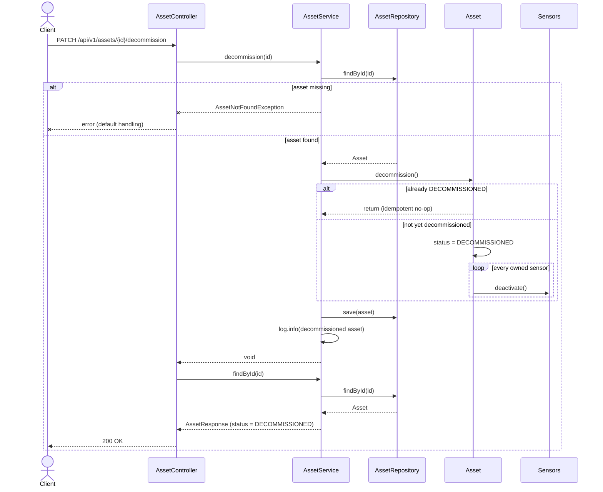
```mermaid
sequenceDiagram
    actor Client
    participant AC as AssetController
    participant AS as AssetService
    participant AR as AssetRepository
    participant A as Asset
    participant S as Sensors

    Client->>AC: PATCH /api/v1/assets/{id}/decommission
    AC->>AS: decommission(id)
    AS->>AR: findById(id)
    alt asset missing
        AS--xAC: AssetNotFoundException
        AC--xClient: error (default handling)
    else asset found
        AR-->>AS: Asset
        AS->>A: decommission()
        alt already DECOMMISSIONED
            A-->>AS: return (idempotent no-op)
        else not yet decommissioned
            A->>A: status = DECOMMISSIONED
            loop every owned sensor
                A->>S: deactivate()
            end
        end
        AS->>AR: save(asset)
        AS->>AS: log.info(decommissioned asset)
        AS-->>AC: void
        AC->>AS: findById(id)
        AS->>AR: findById(id)
        AR-->>AS: Asset
        AS-->>AC: AssetResponse (status = DECOMMISSIONED)
        AC-->>Client: 200 OK
    end
```

### E6 — `DELETE /api/v1/assets/{id}`

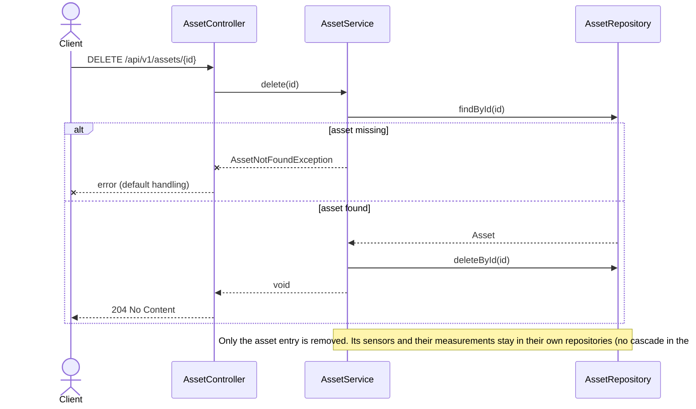
```mermaid
sequenceDiagram
    actor Client
    participant AC as AssetController
    participant AS as AssetService
    participant AR as AssetRepository

    Client->>AC: DELETE /api/v1/assets/{id}
    AC->>AS: delete(id)
    AS->>AR: findById(id)
    alt asset missing
        AS--xAC: AssetNotFoundException
        AC--xClient: error (default handling)
    else asset found
        AR-->>AS: Asset
        AS->>AR: deleteById(id)
        AS-->>AC: void
        AC-->>Client: 204 No Content
    end
    Note over AS,AR: Only the asset entry is removed. Its sensors and their measurements stay in their own repositories (no cascade in the current code).
```

### E7 — `GET /api/v1/assets/{assetId}/measurements`

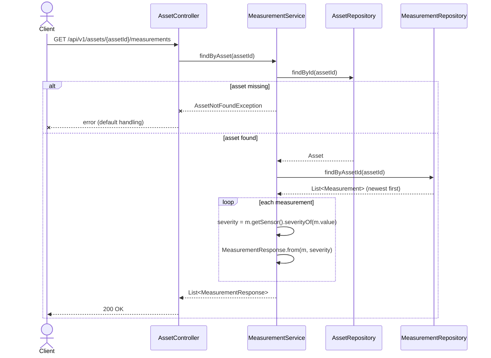
```mermaid
sequenceDiagram
    actor Client
    participant AC as AssetController
    participant MS as MeasurementService
    participant AR as AssetRepository
    participant MR as MeasurementRepository

    Client->>AC: GET /api/v1/assets/{assetId}/measurements
    AC->>MS: findByAsset(assetId)
    MS->>AR: findById(assetId)
    alt asset missing
        MS--xAC: AssetNotFoundException
        AC--xClient: error (default handling)
    else asset found
        AR-->>MS: Asset
        MS->>MR: findByAssetId(assetId)
        MR-->>MS: List<Measurement> (newest first)
        loop each measurement
            MS->>MS: severity = m.getSensor().severityOf(m.value)
            MS->>MS: MeasurementResponse.from(m, severity)
        end
        MS-->>AC: List<MeasurementResponse>
        AC-->>Client: 200 OK
    end
```

## 2. SensorController

### E1 — `GET /api/v1/assets/{assetId}/sensors`

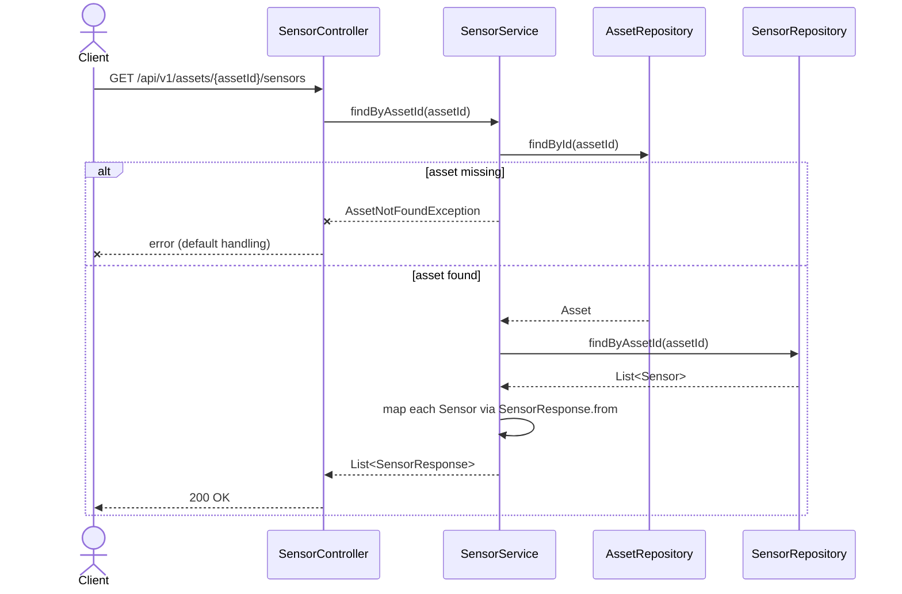
```mermaid
sequenceDiagram
    actor Client
    participant SC as SensorController
    participant SS as SensorService
    participant AR as AssetRepository
    participant SR as SensorRepository

    Client->>SC: GET /api/v1/assets/{assetId}/sensors
    SC->>SS: findByAssetId(assetId)
    SS->>AR: findById(assetId)
    alt asset missing
        SS--xSC: AssetNotFoundException
        SC--xClient: error (default handling)
    else asset found
        AR-->>SS: Asset
        SS->>SR: findByAssetId(assetId)
        SR-->>SS: List<Sensor>
        SS->>SS: map each Sensor via SensorResponse.from
        SS-->>SC: List<SensorResponse>
        SC-->>Client: 200 OK
    end
```

### E2 — `POST /api/v1/assets/{assetId}/sensors` (create sensor)

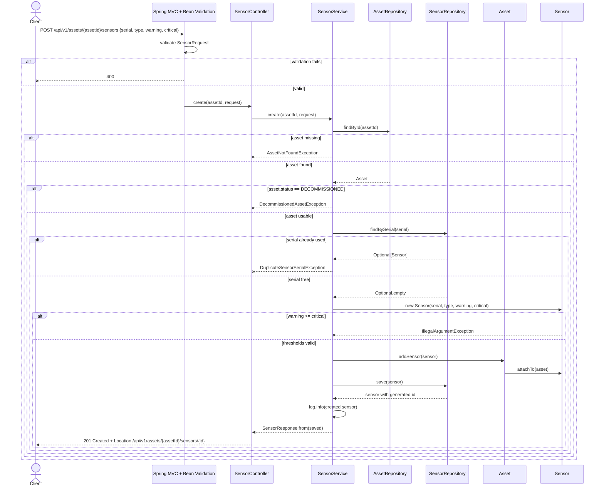
```mermaid
sequenceDiagram
    actor Client
    participant MVC as Spring MVC + Bean Validation
    participant SC as SensorController
    participant SS as SensorService
    participant AR as AssetRepository
    participant SR as SensorRepository
    participant A as Asset
    participant S as Sensor

    Client->>MVC: POST /api/v1/assets/{assetId}/sensors {serial, type, warning, critical}
    MVC->>MVC: validate SensorRequest
    alt validation fails
        MVC--xClient: 400
    else valid
        MVC->>SC: create(assetId, request)
        SC->>SS: create(assetId, request)
        SS->>AR: findById(assetId)
        alt asset missing
            SS--xSC: AssetNotFoundException
        else asset found
            AR-->>SS: Asset
            alt asset.status == DECOMMISSIONED
                SS--xSC: DecommissionedAssetException
            else asset usable
                SS->>SR: findBySerial(serial)
                alt serial already used
                    SR-->>SS: Optional[Sensor]
                    SS--xSC: DuplicateSensorSerialException
                else serial free
                    SR-->>SS: Optional.empty
                    SS->>S: new Sensor(serial, type, warning, critical)
                    alt warning >= critical
                        S--xSS: IllegalArgumentException
                    else thresholds valid
                        SS->>A: addSensor(sensor)
                        A->>S: attachTo(asset)
                        SS->>SR: save(sensor)
                        SR-->>SS: sensor with generated id
                        SS->>SS: log.info(created sensor)
                        SS-->>SC: SensorResponse.from(saved)
                        SC-->>Client: 201 Created + Location /api/v1/assets/{assetId}/sensors/{id}
                    end
                end
            end
        end
    end
```

### E3 — `PATCH /api/v1/assets/sensors/{sensorId}/deactivate`

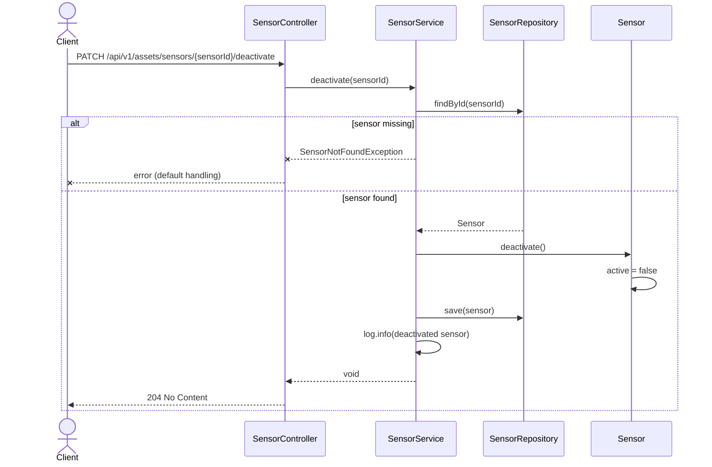
```mermaid
sequenceDiagram
    actor Client
    participant SC as SensorController
    participant SS as SensorService
    participant SR as SensorRepository
    participant S as Sensor

    Client->>SC: PATCH /api/v1/assets/sensors/{sensorId}/deactivate
    SC->>SS: deactivate(sensorId)
    SS->>SR: findById(sensorId)
    alt sensor missing
        SS--xSC: SensorNotFoundException
        SC--xClient: error (default handling)
    else sensor found
        SR-->>SS: Sensor
        SS->>S: deactivate()
        S->>S: active = false
        SS->>SR: save(sensor)
        SS->>SS: log.info(deactivated sensor)
        SS-->>SC: void
        SC-->>Client: 204 No Content
    end
```

## 3. MeasurementController

### E1 — `GET /api/v1/assets/sensors/{sensorId}/measurements`

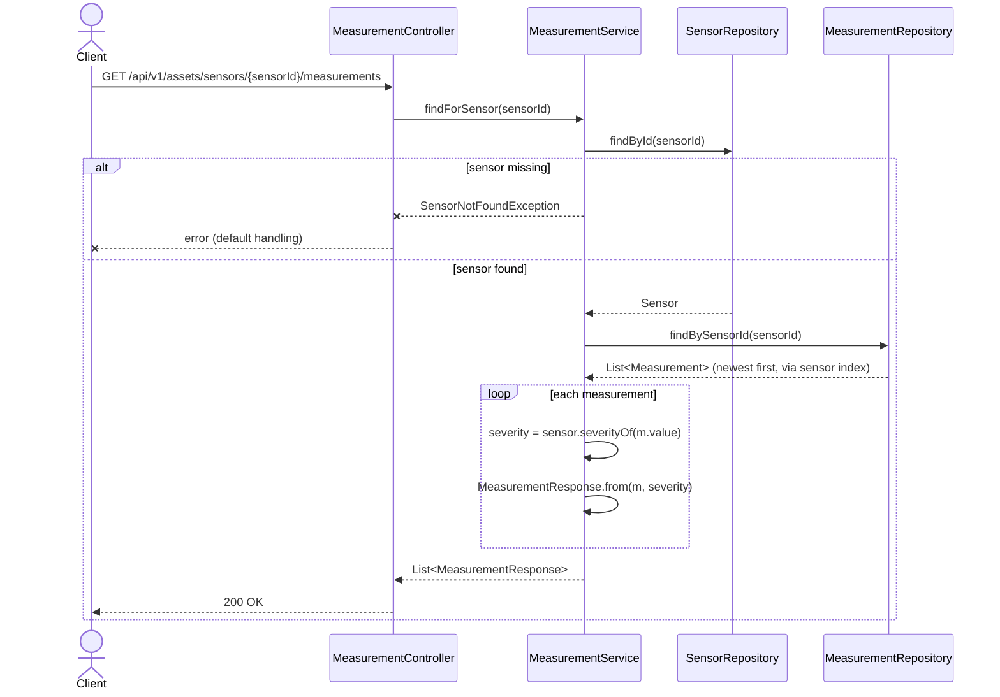
```mermaid
sequenceDiagram
    actor Client
    participant MC as MeasurementController
    participant MS as MeasurementService
    participant SR as SensorRepository
    participant MR as MeasurementRepository

    Client->>MC: GET /api/v1/assets/sensors/{sensorId}/measurements
    MC->>MS: findForSensor(sensorId)
    MS->>SR: findById(sensorId)
    alt sensor missing
        MS--xMC: SensorNotFoundException
        MC--xClient: error (default handling)
    else sensor found
        SR-->>MS: Sensor
        MS->>MR: findBySensorId(sensorId)
        MR-->>MS: List<Measurement> (newest first, via sensor index)
        loop each measurement
            MS->>MS: severity = sensor.severityOf(m.value)
            MS->>MS: MeasurementResponse.from(m, severity)
        end
        MS-->>MC: List<MeasurementResponse>
        MC-->>Client: 200 OK
    end
```

### E2 — `POST /api/v1/assets/sensors/{sensorId}/measurements` (record measurement)

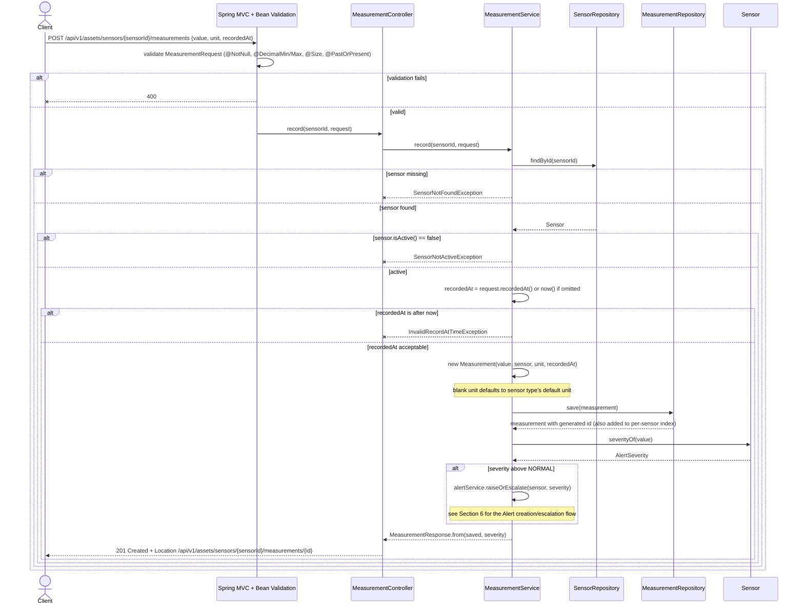
```mermaid
sequenceDiagram
    actor Client
    participant MVC as Spring MVC + Bean Validation
    participant MC as MeasurementController
    participant MS as MeasurementService
    participant SR as SensorRepository
    participant MR as MeasurementRepository
    participant S as Sensor

    Client->>MVC: POST /api/v1/assets/sensors/{sensorId}/measurements {value, unit, recordedAt}
    MVC->>MVC: validate MeasurementRequest (@NotNull, @DecimalMin/Max, @Size, @PastOrPresent)
    alt validation fails
        MVC--xClient: 400
    else valid
        MVC->>MC: record(sensorId, request)
        MC->>MS: record(sensorId, request)
        MS->>SR: findById(sensorId)
        alt sensor missing
            MS--xMC: SensorNotFoundException
        else sensor found
            SR-->>MS: Sensor
            alt sensor.isActive() == false
                MS--xMC: SensorNotActiveException
            else active
                MS->>MS: recordedAt = request.recordedAt() or now() if omitted
                alt recordedAt is after now
                    MS--xMC: InvalidRecordAtTimeException
                else recordedAt acceptable
                    MS->>MS: new Measurement(value, sensor, unit, recordedAt)
                    Note over MS: blank unit defaults to sensor type's default unit
                    MS->>MR: save(measurement)
                    MR-->>MS: measurement with generated id (also added to per-sensor index)
                    MS->>S: severityOf(value)
                    S-->>MS: AlertSeverity
                    alt severity above NORMAL
                        MS->>MS: alertService.raiseOrEscalate(sensor, severity)
                        Note over MS: see Section 6 for the Alert creation/escalation flow
                    end
                    MS-->>MC: MeasurementResponse.from(saved, severity)
                    MC-->>Client: 201 Created + Location /api/v1/assets/sensors/{sensorId}/measurements/{id}
                end
            end
        end
    end
```

### E3 — `GET /api/v1/assets/sensors/{sensorId}/latest`

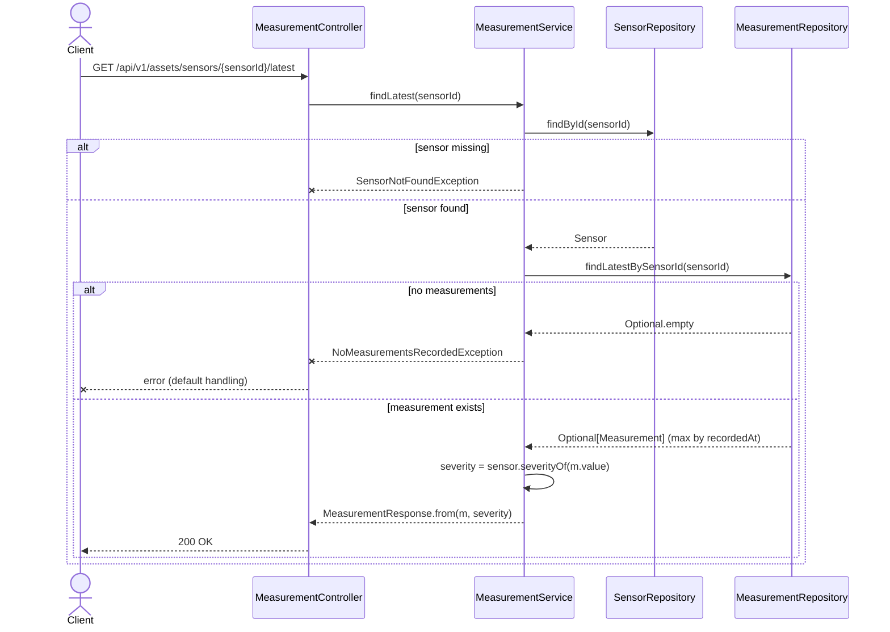
```mermaid
sequenceDiagram
    actor Client
    participant MC as MeasurementController
    participant MS as MeasurementService
    participant SR as SensorRepository
    participant MR as MeasurementRepository

    Client->>MC: GET /api/v1/assets/sensors/{sensorId}/latest
    MC->>MS: findLatest(sensorId)
    MS->>SR: findById(sensorId)
    alt sensor missing
        MS--xMC: SensorNotFoundException
    else sensor found
        SR-->>MS: Sensor
        MS->>MR: findLatestBySensorId(sensorId)
        alt no measurements
            MR-->>MS: Optional.empty
            MS--xMC: NoMeasurementsRecordedException
            MC--xClient: error (default handling)
        else measurement exists
            MR-->>MS: Optional[Measurement] (max by recordedAt)
            MS->>MS: severity = sensor.severityOf(m.value)
            MS-->>MC: MeasurementResponse.from(m, severity)
            MC-->>Client: 200 OK
        end
    end
```

## 4. Service use case without an endpoint

`SensorService.updateThresholds` is implemented and complete, but no controller method calls it. It is reachable only from other Java code or tests.

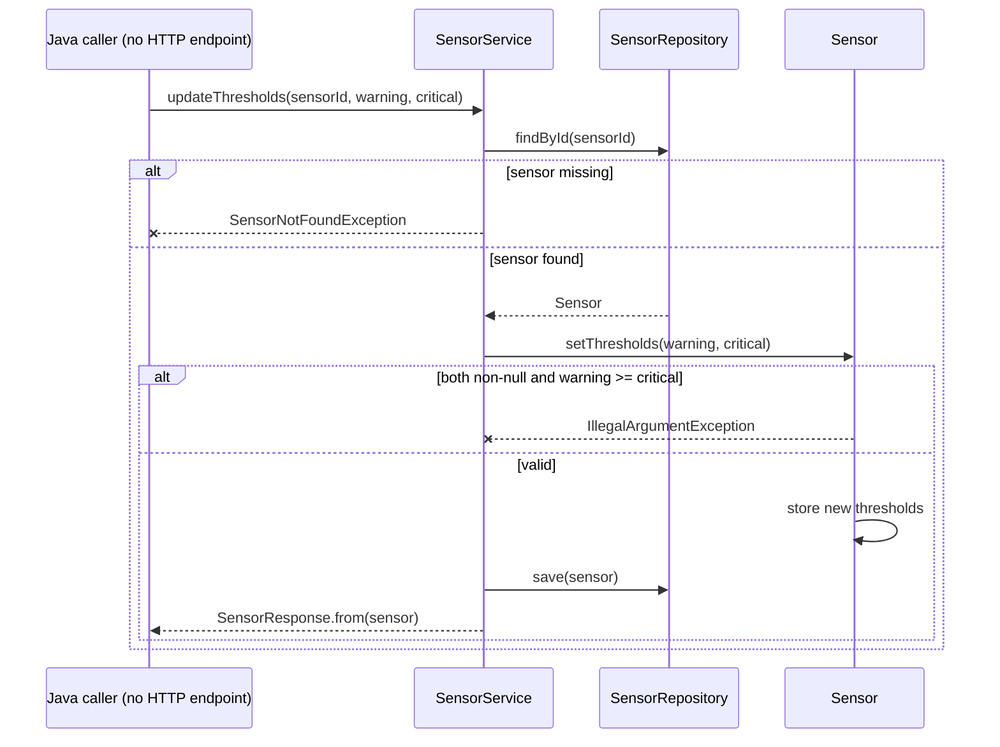
```mermaid
sequenceDiagram
    participant Caller as Java caller (no HTTP endpoint)
    participant SS as SensorService
    participant SR as SensorRepository
    participant S as Sensor

    Caller->>SS: updateThresholds(sensorId, warning, critical)
    SS->>SR: findById(sensorId)
    alt sensor missing
        SS--xCaller: SensorNotFoundException
    else sensor found
        SR-->>SS: Sensor
        SS->>S: setThresholds(warning, critical)
        alt both non-null and warning >= critical
            S--xSS: IllegalArgumentException
        else valid
            S->>S: store new thresholds
            SS->>SR: save(sensor)
            SS-->>Caller: SensorResponse.from(sensor)
        end
    end
```

## 5. Domain operations with no service or endpoint

These `Asset` methods exist in the domain model but nothing in the service or controller layers calls them: `Asset.putUnderMaintenance()` and `Asset.activate()`. `Sensor.activate()` is likewise unused outside the domain. They are not documented as API capabilities.

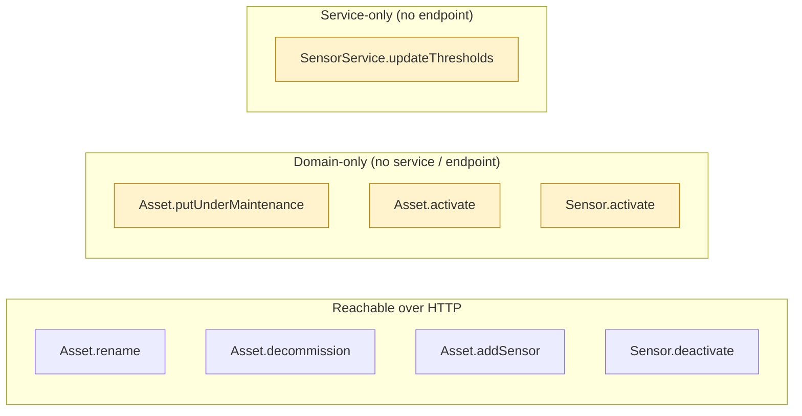
```mermaid
flowchart LR
    subgraph Reachable["Reachable over HTTP"]
        r1["Asset.rename"]
        r2["Asset.decommission"]
        r3["Asset.addSensor"]
        r4["Sensor.deactivate"]
    end
    subgraph Domain_only["Domain-only (no service / endpoint)"]
        d1["Asset.putUnderMaintenance"]
        d2["Asset.activate"]
        d3["Sensor.activate"]
    end
    subgraph Service_only["Service-only (no endpoint)"]
        s1["SensorService.updateThresholds"]
    end
    classDef dead fill:#fff3cd,stroke:#b8860b
    class d1,d2,d3,s1 dead
```

## 6. Alert workflows

Alerts are never created directly by a client — they're a side effect of recording a
measurement that breaches a sensor's threshold. `AlertController` only exposes
reading, acknowledging, and resolving an alert that already exists.

### Alert creation and escalation (triggered from `POST .../measurements`)

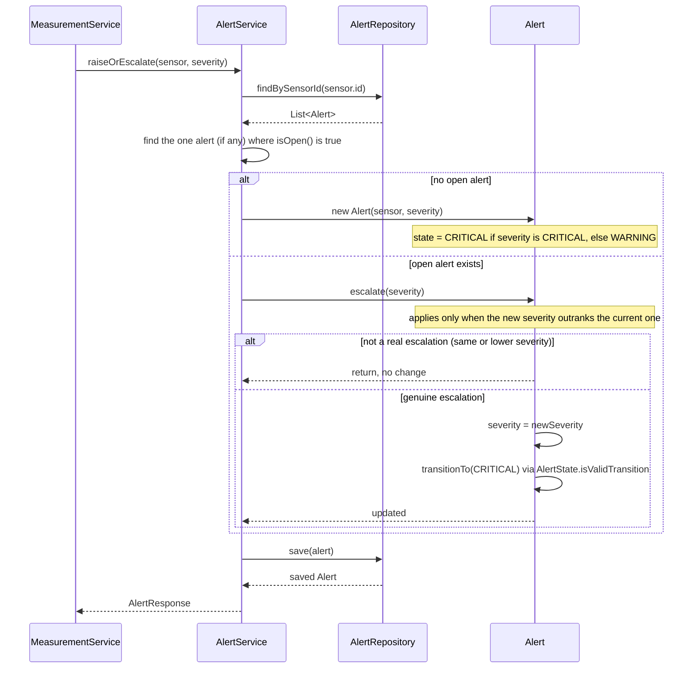
```mermaid
sequenceDiagram
    participant MS as MeasurementService
    participant AS as AlertService
    participant AR as AlertRepository
    participant A as Alert

    MS->>AS: raiseOrEscalate(sensor, severity)
    AS->>AR: findBySensorId(sensor.id)
    AR-->>AS: List<Alert>
    AS->>AS: find the one alert (if any) where isOpen() is true
    alt no open alert
        AS->>A: new Alert(sensor, severity)
        Note over A: state = CRITICAL if severity is CRITICAL, else WARNING
    else open alert exists
        AS->>A: escalate(severity)
        Note over A: applies only when the new severity outranks the current one
        alt not a real escalation (same or lower severity)
            A-->>AS: return, no change
        else genuine escalation
            A->>A: severity = newSeverity
            A->>A: transitionTo(CRITICAL) via AlertState.isValidTransition
            A-->>AS: updated
        end
    end
    AS->>AR: save(alert)
    AR-->>AS: saved Alert
    AS-->>MS: AlertResponse
```

### Alert acknowledgement

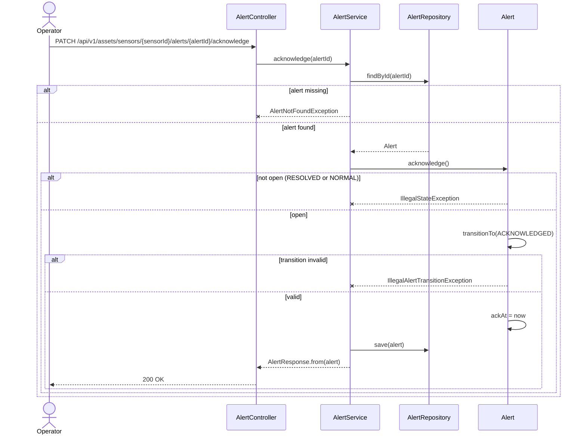
```mermaid
sequenceDiagram
    actor Operator
    participant AC as AlertController
    participant AS as AlertService
    participant AR as AlertRepository
    participant A as Alert

    Operator->>AC: PATCH /api/v1/assets/sensors/{sensorId}/alerts/{alertId}/acknowledge
    AC->>AS: acknowledge(alertId)
    AS->>AR: findById(alertId)
    alt alert missing
        AS--xAC: AlertNotFoundException
    else alert found
        AR-->>AS: Alert
        AS->>A: acknowledge()
        alt not open (RESOLVED or NORMAL)
            A--xAS: IllegalStateException
        else open
            A->>A: transitionTo(ACKNOWLEDGED)
            alt transition invalid
                A--xAS: IllegalAlertTransitionException
            else valid
                A->>A: ackAt = now
                AS->>AR: save(alert)
                AS-->>AC: AlertResponse.from(alert)
                AC-->>Operator: 200 OK
            end
        end
    end
```

### Alert resolution

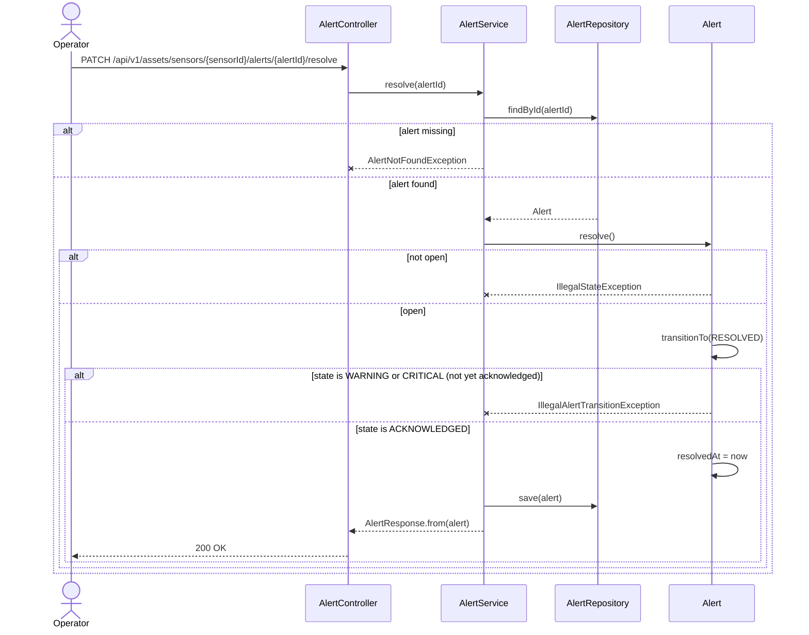
```mermaid
sequenceDiagram
    actor Operator
    participant AC as AlertController
    participant AS as AlertService
    participant AR as AlertRepository
    participant A as Alert

    Operator->>AC: PATCH /api/v1/assets/sensors/{sensorId}/alerts/{alertId}/resolve
    AC->>AS: resolve(alertId)
    AS->>AR: findById(alertId)
    alt alert missing
        AS--xAC: AlertNotFoundException
    else alert found
        AR-->>AS: Alert
        AS->>A: resolve()
        alt not open
            A--xAS: IllegalStateException
        else open
            A->>A: transitionTo(RESOLVED)
            alt state is WARNING or CRITICAL (not yet acknowledged)
                A--xAS: IllegalAlertTransitionException
            else state is ACKNOWLEDGED
                A->>A: resolvedAt = now
                AS->>AR: save(alert)
                AS-->>AC: AlertResponse.from(alert)
                AC-->>Operator: 200 OK
            end
        end
    end
```

### Query alerts

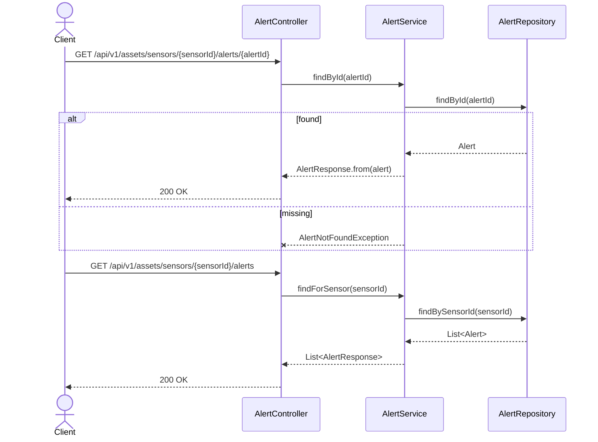
```mermaid
sequenceDiagram
    actor Client
    participant AC as AlertController
    participant AS as AlertService
    participant AR as AlertRepository

    Client->>AC: GET /api/v1/assets/sensors/{sensorId}/alerts/{alertId}
    AC->>AS: findById(alertId)
    AS->>AR: findById(alertId)
    alt found
        AR-->>AS: Alert
        AS-->>AC: AlertResponse.from(alert)
        AC-->>Client: 200 OK
    else missing
        AS--xAC: AlertNotFoundException
    end

    Client->>AC: GET /api/v1/assets/sensors/{sensorId}/alerts
    AC->>AS: findForSensor(sensorId)
    AS->>AR: findBySensorId(sensorId)
    AR-->>AS: List<Alert>
    AS-->>AC: List<AlertResponse>
    AC-->>Client: 200 OK
```

