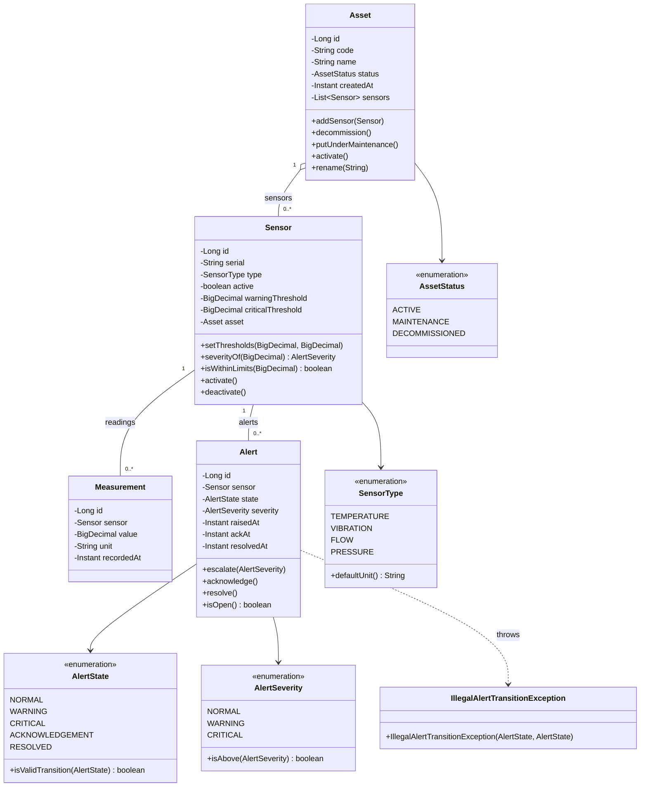
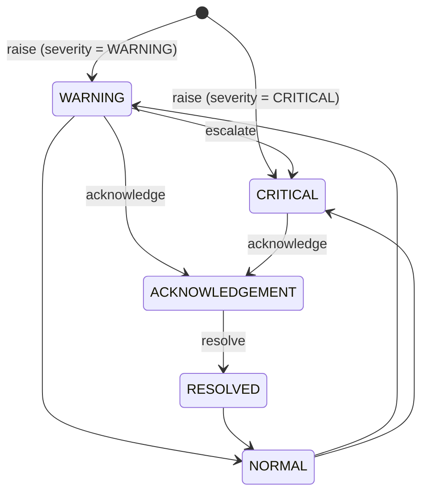

# Domain Model

This document describes the core domain model of the Asset Monitoring system.

## Overview

- An **Asset** (e.g. a machine or piece of equipment) has a status and owns a list of **Sensor**s.
- A **Sensor** belongs to exactly one asset, has a type, and defines warning/critical thresholds.
- A **Measurement** is a single reading recorded by a sensor at a point in time.
- An **Alert** is raised against a sensor when a measurement breaches a threshold, and moves through a defined lifecycle (state machine).

## Class Diagram

## Alert State Machine

An `Alert` transitions between states via `Alert.transitionTo`, validated by `AlertState.isValidTransition`. An invalid transition throws `IllegalAlertTransitionException`.

## Notes

- `Asset.addSensor` also calls `Sensor.attachTo`, keeping the bidirectional Asset↔Sensor link consistent; `Asset.getSensors()` returns an immutable copy to protect encapsulation.
- `Asset.decommission()` cascades to deactivate all of its sensors.
- `Sensor.severityOf(value)` compares a reading against `criticalThreshold` first, then `warningThreshold`, defaulting to `NORMAL`.
- `Alert` cannot be constructed with `AlertSeverity.NORMAL` — an alert only exists once a breach has occurred.
- Equality: `Asset` by `code`, `Sensor` by `serial`, `Alert` by `id`.
