# Service Use-Case Flowcharts

One flowchart per service method, covering every use case in `AssetService`, `SensorService`, `MeasurementService`, and `AlertService`. Endpoint-level sequence diagrams are in [api-sequence-diagrams.md](api-sequence-diagrams.md).

Legend: rectangles are steps, diamonds are decisions, red nodes are thrown exceptions.

## 1. AssetService

### create(AssetRequest)

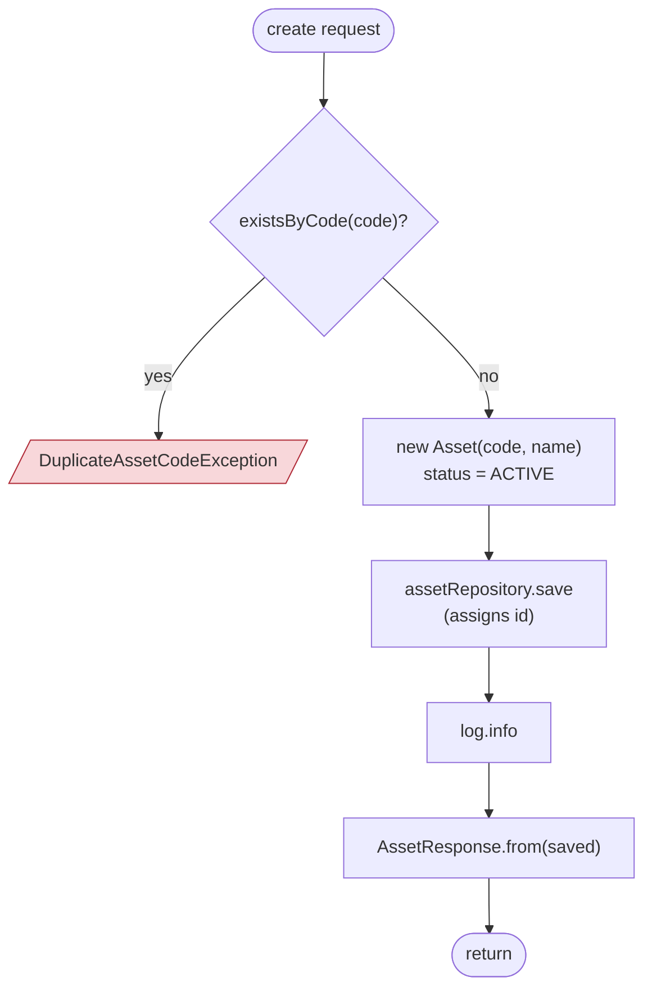
```mermaid
flowchart TD
    A([create request]) --> B{"existsByCode(code)?"}
    B -- yes --> X1[/DuplicateAssetCodeException/]
    B -- no --> C["new Asset(code, name)<br/>status = ACTIVE"]
    C --> D["assetRepository.save<br/>(assigns id)"]
    D --> E[log.info]
    E --> F["AssetResponse.from(saved)"]
    F --> G([return])
    classDef err fill:#f8d7da,stroke:#b02a37
    class X1 err
```

### findById(Long)

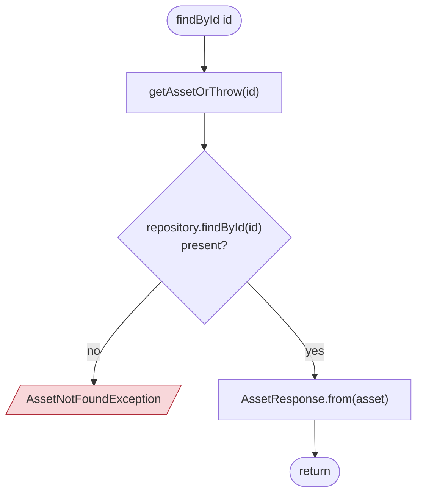
```mermaid
flowchart TD
    A([findById id]) --> B["getAssetOrThrow(id)"]
    B --> C{"repository.findById(id)<br/>present?"}
    C -- no --> X1[/AssetNotFoundException/]
    C -- yes --> D["AssetResponse.from(asset)"]
    D --> E([return])
    classDef err fill:#f8d7da,stroke:#b02a37
    class X1 err
```

### findAll(AssetStatus)

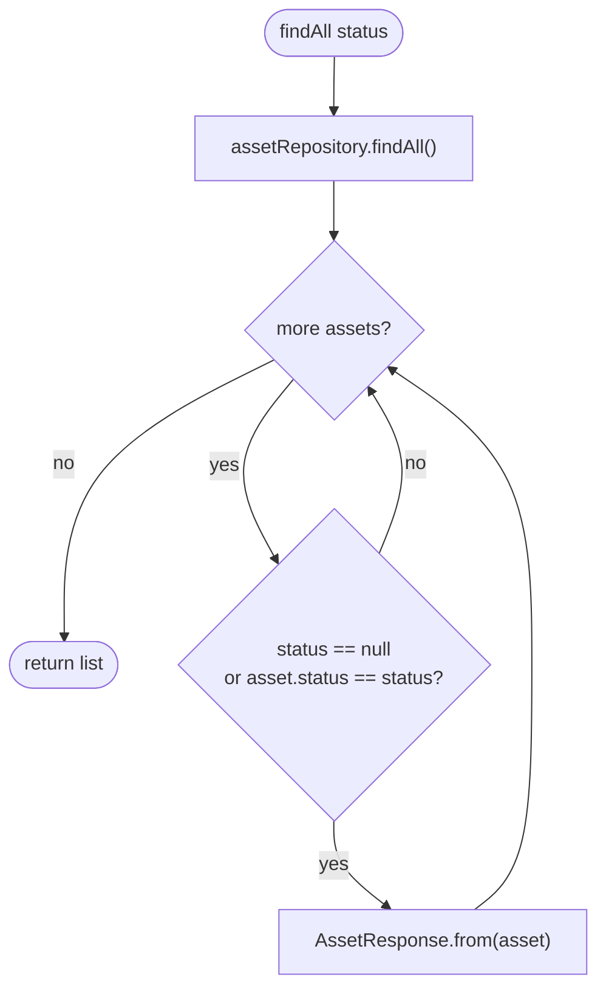
```mermaid
flowchart TD
    A([findAll status]) --> B["assetRepository.findAll()"]
    B --> C{"more assets?"}
    C -- no --> G([return list])
    C -- yes --> D{"status == null<br/>or asset.status == status?"}
    D -- no --> C
    D -- yes --> E["AssetResponse.from(asset)"]
    E --> C
```

### update(Long, AssetRequest)

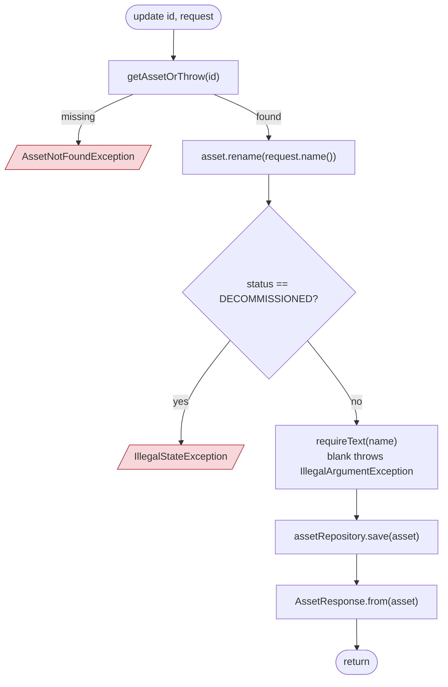
```mermaid
flowchart TD
    A([update id, request]) --> B["getAssetOrThrow(id)"]
    B -- missing --> X1[/AssetNotFoundException/]
    B -- found --> C["asset.rename(request.name())"]
    C --> D{"status == DECOMMISSIONED?"}
    D -- yes --> X2[/IllegalStateException/]
    D -- no --> E["requireText(name)<br/>blank throws IllegalArgumentException"]
    E --> F["assetRepository.save(asset)"]
    F --> G["AssetResponse.from(asset)"]
    G --> H([return])
    classDef err fill:#f8d7da,stroke:#b02a37
    class X1,X2 err
```

### decommission(Long)

```mermaid
flowchart TD
    A([decommission id]) --> B["getAssetOrThrow(id)"]
    B -- missing --> X1[/AssetNotFoundException/]
    B -- found --> C{"already DECOMMISSIONED?"}
    C -- yes --> S["asset.decommission() returns<br/>(idempotent)"]
    C -- no --> D["status = DECOMMISSIONED"]
    D --> E["each owned sensor.deactivate()"]
    E --> S2[asset.decommission() done]
    S --> F["assetRepository.save(asset)"]
    S2 --> F
    F --> G[log.info]
    G --> H([return void])
    classDef err fill:#f8d7da,stroke:#b02a37
    class X1 err
```

### delete(Long)

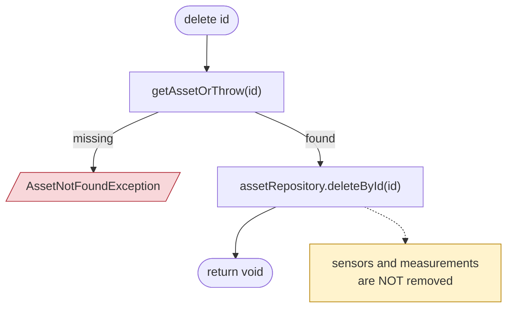
```mermaid
flowchart TD
    A([delete id]) --> B["getAssetOrThrow(id)"]
    B -- missing --> X1[/AssetNotFoundException/]
    B -- found --> C["assetRepository.deleteById(id)"]
    C --> D([return void])
    C -.-> N["sensors and measurements<br/>are NOT removed"]
    classDef err fill:#f8d7da,stroke:#b02a37
    classDef note fill:#fff3cd,stroke:#b8860b
    class X1 err
    class N note
```

## 2. SensorService

### create(Long, SensorRequest)

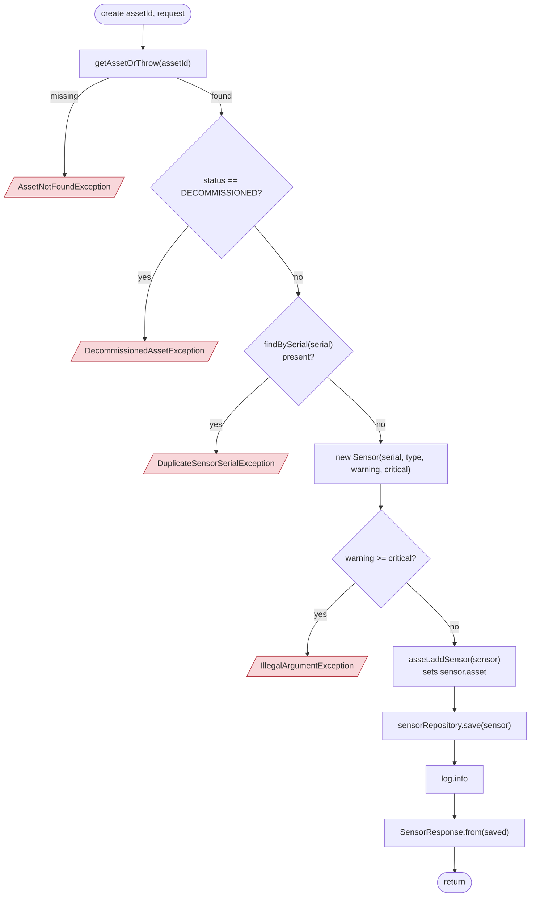
```mermaid
flowchart TD
    A([create assetId, request]) --> B["getAssetOrThrow(assetId)"]
    B -- missing --> X1[/AssetNotFoundException/]
    B -- found --> C{"status == DECOMMISSIONED?"}
    C -- yes --> X2[/DecommissionedAssetException/]
    C -- no --> D{"findBySerial(serial)<br/>present?"}
    D -- yes --> X3[/DuplicateSensorSerialException/]
    D -- no --> E["new Sensor(serial, type, warning, critical)"]
    E --> F{"warning >= critical?"}
    F -- yes --> X4[/IllegalArgumentException/]
    F -- no --> G["asset.addSensor(sensor)<br/>sets sensor.asset"]
    G --> H["sensorRepository.save(sensor)"]
    H --> I[log.info]
    I --> J["SensorResponse.from(saved)"]
    J --> K([return])
    classDef err fill:#f8d7da,stroke:#b02a37
    class X1,X2,X3,X4 err
```

### findByAssetId(Long)

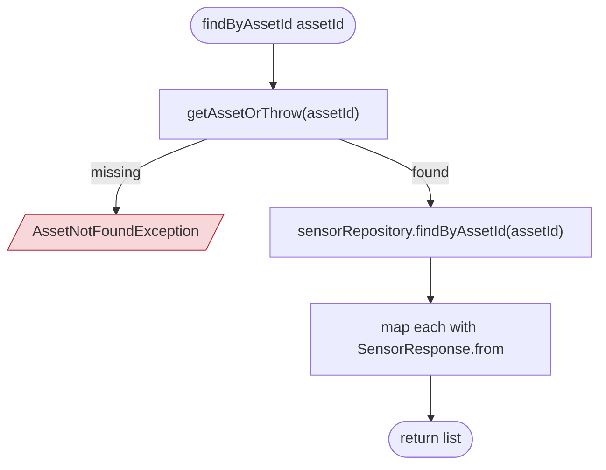
```mermaid
flowchart TD
    A([findByAssetId assetId]) --> B["getAssetOrThrow(assetId)"]
    B -- missing --> X1[/AssetNotFoundException/]
    B -- found --> C["sensorRepository.findByAssetId(assetId)"]
    C --> D["map each with SensorResponse.from"]
    D --> E([return list])
    classDef err fill:#f8d7da,stroke:#b02a37
    class X1 err
```

### deactivate(Long)

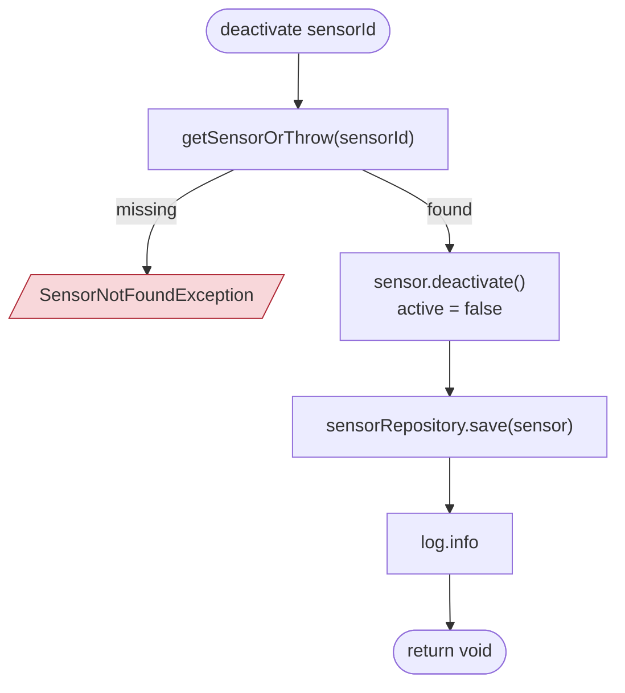
```mermaid
flowchart TD
    A([deactivate sensorId]) --> B["getSensorOrThrow(sensorId)"]
    B -- missing --> X1[/SensorNotFoundException/]
    B -- found --> C["sensor.deactivate()<br/>active = false"]
    C --> D["sensorRepository.save(sensor)"]
    D --> E[log.info]
    E --> F([return void])
    classDef err fill:#f8d7da,stroke:#b02a37
    class X1 err
```

### updateThresholds(Long, BigDecimal, BigDecimal) — no endpoint

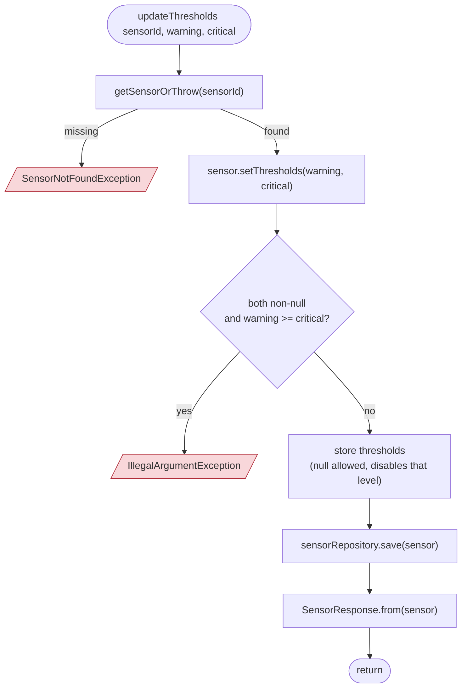
```mermaid
flowchart TD
    A([updateThresholds sensorId, warning, critical]) --> B["getSensorOrThrow(sensorId)"]
    B -- missing --> X1[/SensorNotFoundException/]
    B -- found --> C["sensor.setThresholds(warning, critical)"]
    C --> D{"both non-null<br/>and warning >= critical?"}
    D -- yes --> X2[/IllegalArgumentException/]
    D -- no --> E["store thresholds<br/>(null allowed, disables that level)"]
    E --> F["sensorRepository.save(sensor)"]
    F --> G["SensorResponse.from(sensor)"]
    G --> H([return])
    classDef err fill:#f8d7da,stroke:#b02a37
    class X1,X2 err
```

## 3. MeasurementService

### record(Long, MeasurementRequest)

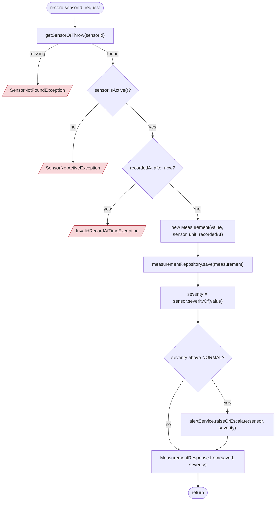
```mermaid
flowchart TD
    A([record sensorId, request]) --> B["getSensorOrThrow(sensorId)"]
    B -- missing --> X1[/SensorNotFoundException/]
    B -- found --> C{"sensor.isActive()?"}
    C -- no --> X2[/SensorNotActiveException/]
    C -- yes --> D{"recordedAt after now?"}
    D -- yes --> X3[/InvalidRecordAtTimeException/]
    D -- no --> E["new Measurement(value, sensor, unit, recordedAt)"]
    E --> F["measurementRepository.save(measurement)"]
    F --> G["severity = sensor.severityOf(value)"]
    G --> H{"severity above NORMAL?"}
    H -- yes --> P["alertService.raiseOrEscalate(sensor, severity)"]
    H -- no --> I
    P --> I["MeasurementResponse.from(saved, severity)"]
    I --> J([return])
    classDef err fill:#f8d7da,stroke:#b02a37
    class X1,X2,X3 err
```

`recordedAt` defaults to `Instant.now()` when the client omits it, before the future-date check above runs.

### findForSensor(Long)

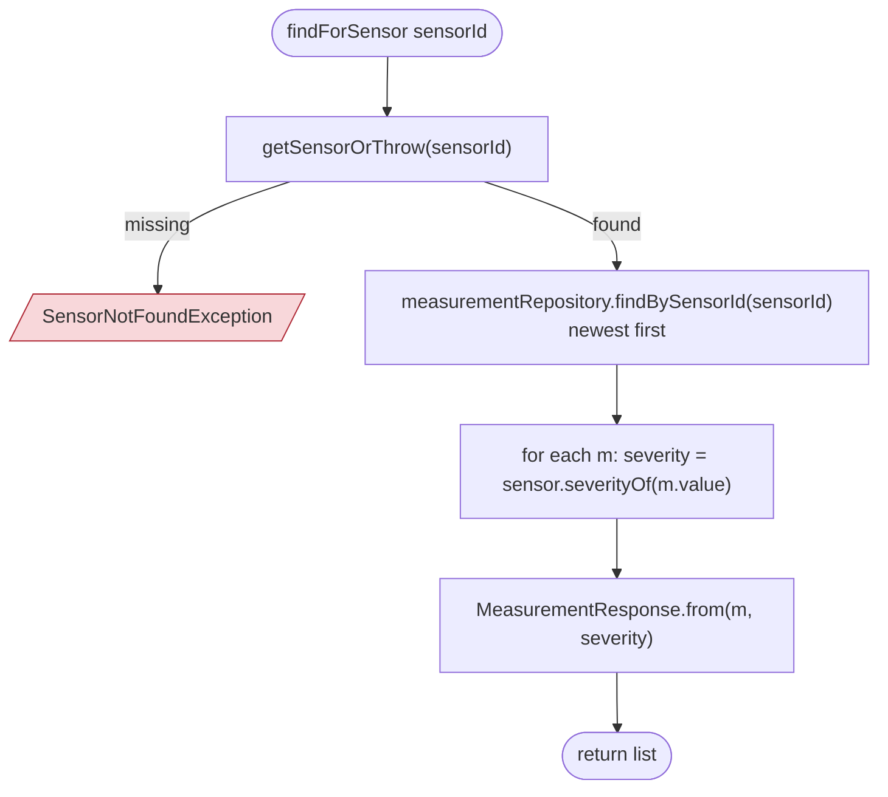
```mermaid
flowchart TD
    A([findForSensor sensorId]) --> B["getSensorOrThrow(sensorId)"]
    B -- missing --> X1[/SensorNotFoundException/]
    B -- found --> C["measurementRepository.findBySensorId(sensorId)<br/>newest first"]
    C --> D["for each m: severity = sensor.severityOf(m.value)"]
    D --> E["MeasurementResponse.from(m, severity)"]
    E --> F([return list])
    classDef err fill:#f8d7da,stroke:#b02a37
    class X1 err
```

### findLatest(Long)

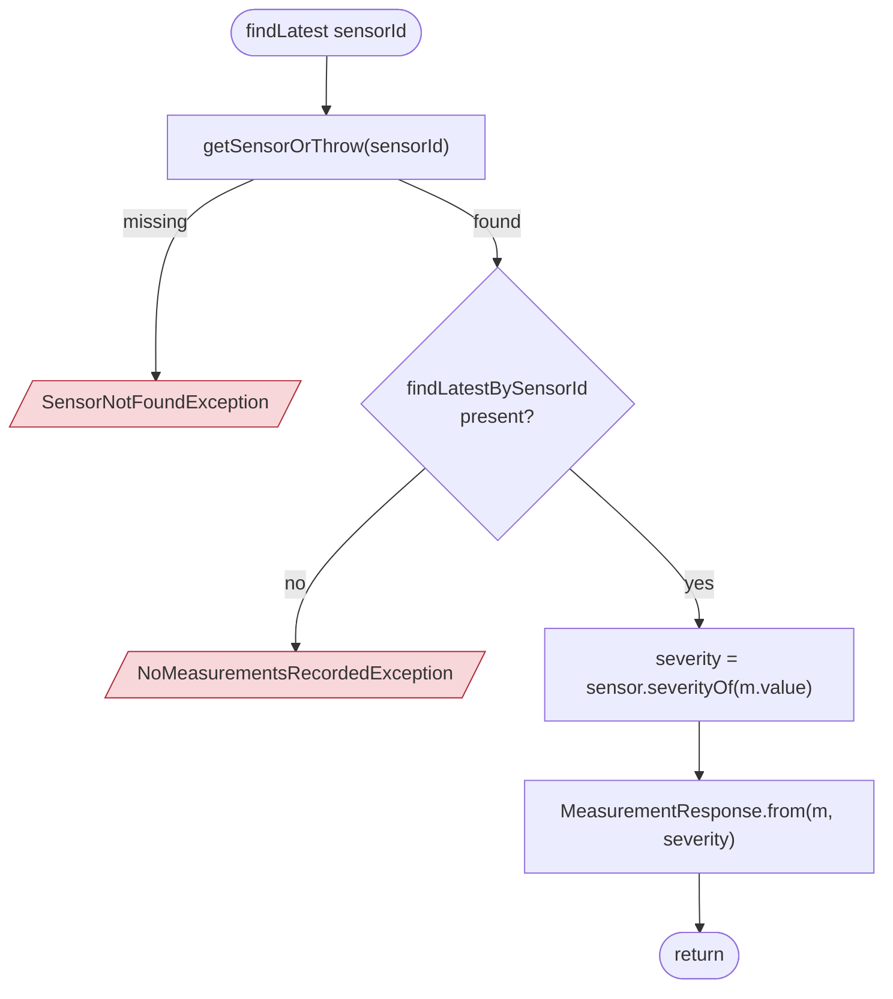
```mermaid
flowchart TD
    A([findLatest sensorId]) --> B["getSensorOrThrow(sensorId)"]
    B -- missing --> X1[/SensorNotFoundException/]
    B -- found --> C{"findLatestBySensorId<br/>present?"}
    C -- no --> X2[/NoMeasurementsRecordedException/]
    C -- yes --> D["severity = sensor.severityOf(m.value)"]
    D --> E["MeasurementResponse.from(m, severity)"]
    E --> F([return])
    classDef err fill:#f8d7da,stroke:#b02a37
    class X1,X2 err
```

### findByAsset(Long)

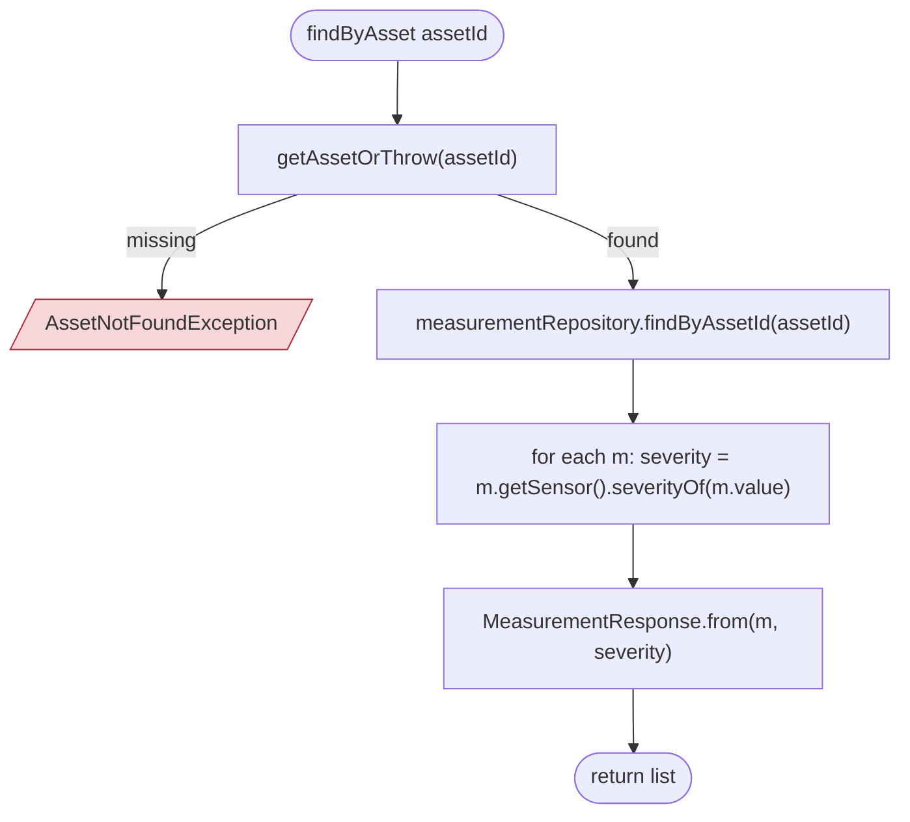
```mermaid
flowchart TD
    A([findByAsset assetId]) --> B["getAssetOrThrow(assetId)"]
    B -- missing --> X1[/AssetNotFoundException/]
    B -- found --> C["measurementRepository.findByAssetId(assetId)"]
    C --> D["for each m: severity = m.getSensor().severityOf(m.value)"]
    D --> E["MeasurementResponse.from(m, severity)"]
    E --> F([return list])
    classDef err fill:#f8d7da,stroke:#b02a37
    class X1 err
```

## 4. Severity evaluation (Sensor.severityOf)

Used by every measurement use case above.

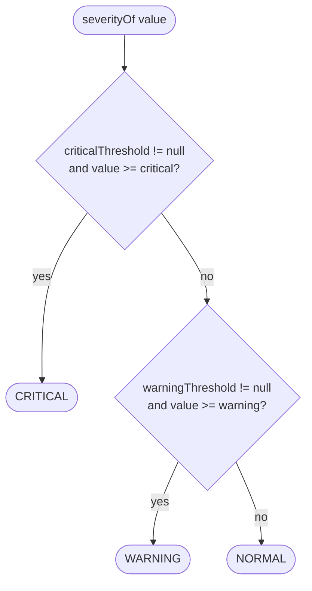
```mermaid
flowchart TD
    A([severityOf value]) --> B{"criticalThreshold != null<br/>and value >= critical?"}
    B -- yes --> C([CRITICAL])
    B -- no --> D{"warningThreshold != null<br/>and value >= warning?"}
    D -- yes --> E([WARNING])
    D -- no --> F([NORMAL])
```

## 5. AlertService

Alerts are never created via a direct endpoint — `raiseOrEscalate` is called only
from `MeasurementService.record()` when a measurement's severity is above `NORMAL`.

### raiseOrEscalate(Sensor, AlertSeverity)

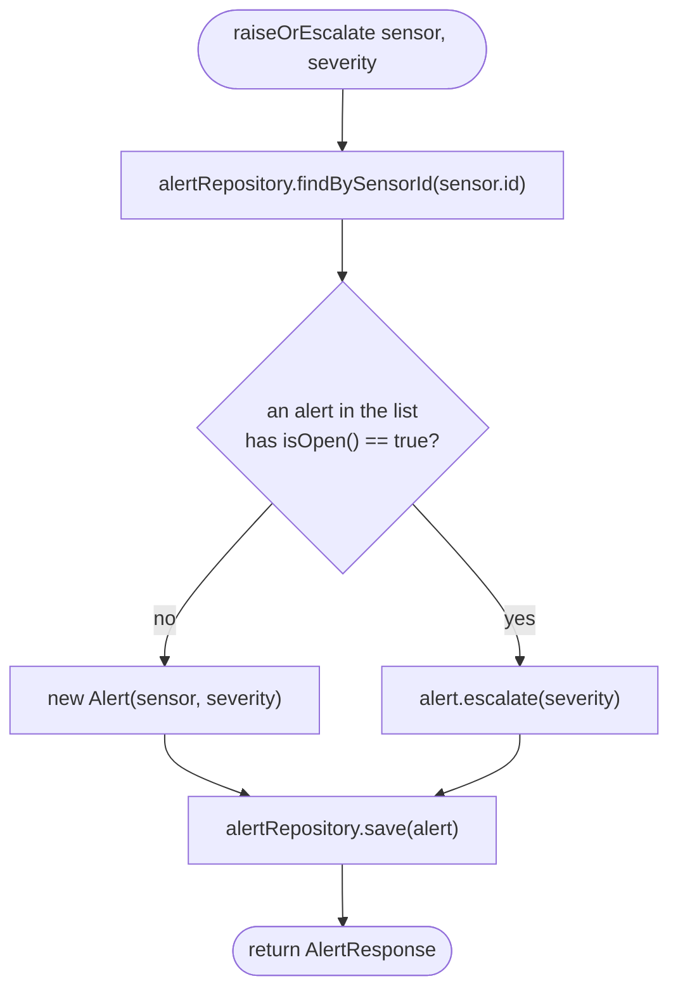
```mermaid
flowchart TD
    A([raiseOrEscalate sensor, severity]) --> C["alertRepository.findBySensorId(sensor.id)"]
    C --> D{"an alert in the list<br/>has isOpen() == true?"}
    D -- no --> E["new Alert(sensor, severity)"]
    D -- yes --> F["alert.escalate(severity)"]
    E --> G["alertRepository.save(alert)"]
    F --> G
    G --> H([return AlertResponse])
```

`escalate(newSeverity)` only takes effect when `newSeverity` outranks the alert's
current severity — otherwise it's a no-op and the alert is saved unchanged. This
method is never called with `severity == NORMAL`: the caller (`MeasurementService`)
only invokes it once it has already checked severity is above `NORMAL`.

### acknowledge(Long) and resolve(Long)

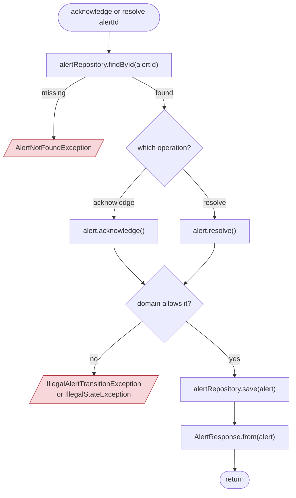
```mermaid
flowchart TD
    A([acknowledge or resolve alertId]) --> B["alertRepository.findById(alertId)"]
    B -- missing --> X1[/AlertNotFoundException/]
    B -- found --> C{"which operation?"}
    C -- acknowledge --> D["alert.acknowledge()"]
    C -- resolve --> E["alert.resolve()"]
    D --> F{"domain allows it?"}
    E --> F
    F -- no --> X2[/IllegalAlertTransitionException<br/>or IllegalStateException/]
    F -- yes --> G["alertRepository.save(alert)"]
    G --> H["AlertResponse.from(alert)"]
    H --> I([return])
    classDef err fill:#f8d7da,stroke:#b02a37
    class X1,X2 err
```

### findById(Long) and findForSensor(Long)

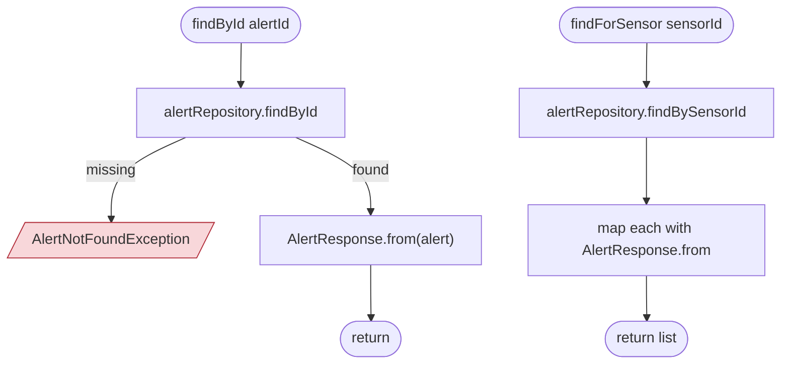
```mermaid
flowchart TD
    A([findById alertId]) --> B["alertRepository.findById"]
    B -- missing --> X1[/AlertNotFoundException/]
    B -- found --> C["AlertResponse.from(alert)"]
    C --> D([return])
    E([findForSensor sensorId]) --> F["alertRepository.findBySensorId"]
    F --> G["map each with AlertResponse.from"]
    G --> H([return list])
    classDef err fill:#f8d7da,stroke:#b02a37
    class X1 err
```
